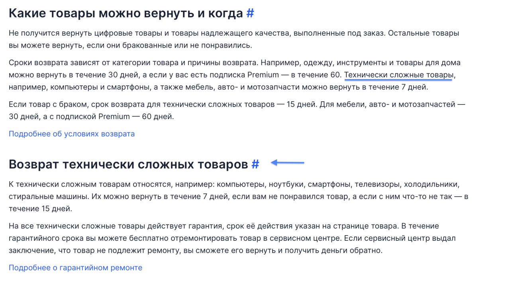
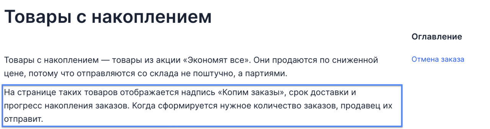

################################################################################
Вычитка статей и предложение улучшений
################################################################################

.. meta::
   :description: articles
   :authors: dtarasova

================================================================================
Возвраты и отмены
================================================================================

В этом случае я бы поработала над логикой подачи сообщения. На мой взгляд, если мы выделяем абзац для какого-то вида товара, то лучше сложить туда все, что его касается, чтобы не знакомить читателя с типом товара два раза. Иначе у покупателя может сложиться мнение о том, что это разные вещи.

К примеру, можно разбить первый заголовок следующим: когда можно вернуть товар – поместить информацию, которая касается случаев, когда покупатель вправе обратиться за возвратом. А далее – добавить структуры для категории товаров (“Одежда, инструменты и товары для дома” и “Технически сложные товары”), где уже предметно дать определение, рассказать о сроках доставки и от чего конкретно она зависит.

================================================================================
Условия доставки товара с накоплением
================================================================================

Здесь я бы обратила внимание на цель сообщения. Первым предложением второго абзаца, как мне кажется, мы хотим показать, как покупателю отличить “товары с накоплением” от других. 

Тогда я бы предложила убрать упоминание “срок доставки” – поскольку эта надпись есть не только на товарах с накоплением. Так, покупатель сконцентрируется только на уникальных атрибутах таких товаров.

